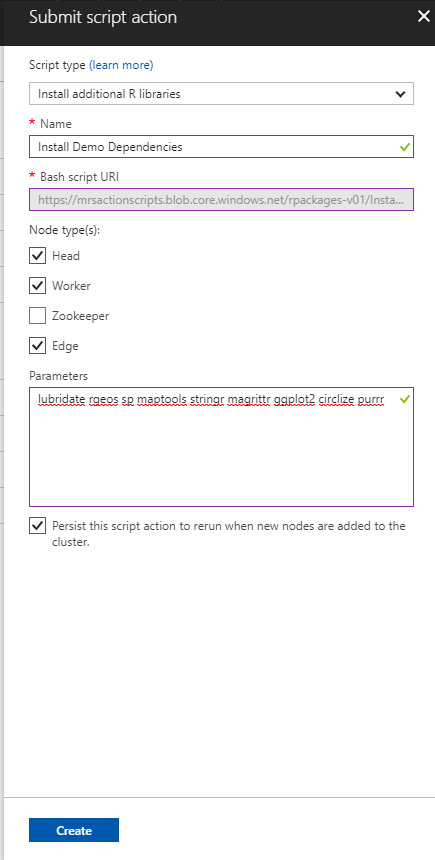
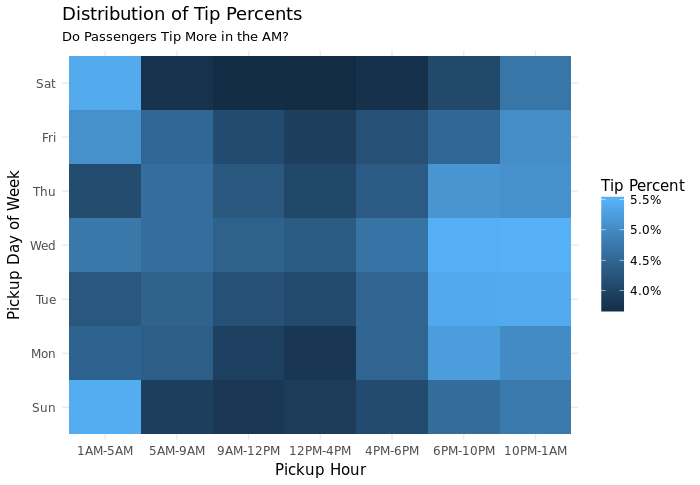
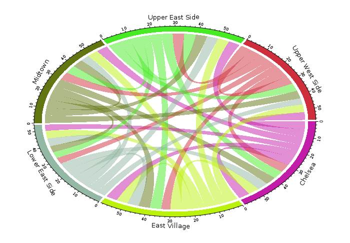

# R Server on HDInsight demo (NYC dataset visualization)

This is a repository to showcase the capabilities of R Server on HDInsight. Basically speaking, it visualizes the [NYC taxi dataset](http://www.nyc.gov/html/tlc/html/about/trip_record_data.shtml) on what is the tip distribution for the trips and what's the travel route distribution (i.e. how many people go from East Village to Mid Town?).

This tutorial is largely based on Ali Zaidi's tutorial [here](https://github.com/akzaidi/spark_nyc_taxi/blob/master/Student-Resources/rmarkdown/3-Visualizing-Taxi-Rides-Spark.Rmd) and you can always get more details on how it works from Ali's repository.

To setup this demo, you need to do a few things:

1. Get the appropriate dataset. For simplicity, usually you just need to download one or two, since if we are analyzing more data then it takes more time and usually doesn’t fit the demo. You can always find the latest data from the NYC Taxi Dataset official repository: http://www.nyc.gov/html/tlc/html/about/trip_record_data.shtml

    However, please be noted that the schema is different for the data of different time period. For example, if you download the data for 2009-01, then the schema is something like 

        vendor_name,Trip_Pickup_DateTime,Trip_Dropoff_DateTime,Passenger_Count,Trip_Distance,Start_Lon,Start_Lat,Rate_Code,store_and_forward,End_Lon,End_Lat,Payment_Type,Fare_Amt,surcharge,mta_tax,Tip_Amt,Tolls_Amt,Total_Amt

    However, if you download data for 2016-01, the schema is like 

        VendorID,tpep_pickup_datetime,tpep_dropoff_datetime,passenger_count,trip_distance,pickup_longitude,pickup_latitude,RatecodeID,store_and_fwd_flag,dropoff_longitude,dropoff_latitude,payment_type,fare_amount,extra,mta_tax,tip_amount,tolls_amount,improvement_surcharge,total_amount

    You should be aware of that especially when you are trying to clean the dataset.

    For this tutorial, I am basically using the data in 2009: https://s3.amazonaws.com/nyc-tlc/trip+data/yellow_tripdata_2009-01.csv (it’s around 2.4 GB). This is already included in the R script

2.	After downloading the data, you should put the trip data into the wasb folders. In this demo we are using wasb:///NYCData/YellowTrip/rawdata
3.	Prepare the environment
    
    Since we are doing distributed analysis using R, it is required that all the HDInsight worker nodes have the required libraries. Fortunately, 
    Install required R libraries in those clusters, using the “Install additional R libraries” command in the script action drop down list:

    
    
    The libraries need to be installed (input the value below to the input box) are:

        lubridate rgeos sp maptools stringr magrittr ggplot2 circlize purrr
        
    You also need to install libgeos on all the nodes. Execute this script action to install libgeos in all nodes: https://raw.githubusercontent.com/xiaoyongzhu/NYCTaxiDataSetVisualization/master/install%20libgeos.sh

4. 	Execute the R scripts in this folder (NYCTaxiDataSetDemo.r)
5.	After execution, you should be able to see two graphs:

    Tip Distribution, shows what's the tip distribution (tip percent) for different pick up hours and different days. The insight we can get from this graph is that for rush hours the tip is usually low, while for after hours pick-up the tip is usually high.

    

    Traffic visualization, showcases how do people usually commute.
    
    

6.	More details on this dataset and what we want to achieve can be found in Ali's original repository above.
